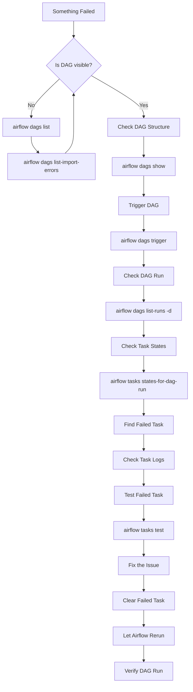

# Airflow Debugging Flow

This flow can be used whenever an Airflow DAG or task fails.



---

## Quick Command Reference

### 1. Check if DAG is visible

```bash
airflow dags list
```

If the DAG is missing:

```bash
airflow dags list-import-errors
```

---

### 2. Check DAG structure

```bash
airflow dags show <dag_id>
```

---

### 3. Trigger the DAG

```bash
airflow dags trigger <dag_id>
```

---

### 4. Find the DAG run

```bash
airflow dags list-runs -d <dag_id>
```

---

### 5. Check task states

```bash
airflow tasks states-for-dag-run \
<dag_id> \
"<run_id>"
```

---

### 6. Debug the failed task

Check the Airflow task logs first.

Then test the individual task:

```bash
airflow tasks test <dag_id> <task_id>
```

Example:

```bash
airflow tasks test snowflake_gold_load load_market_events
```

---

### 7. Fix and rerun

After fixing the underlying issue:

1. Clear the failed task.
2. Let Airflow rerun the task.
3. Check the DAG run again.
4. Verify that all tasks complete successfully.

---

## Debugging Principle

> **DAG → Run → Task → Logs → Root Cause → Fix → Rerun**

This keeps debugging systematic instead of repeatedly triggering the entire pipeline and guessing what went wrong.
